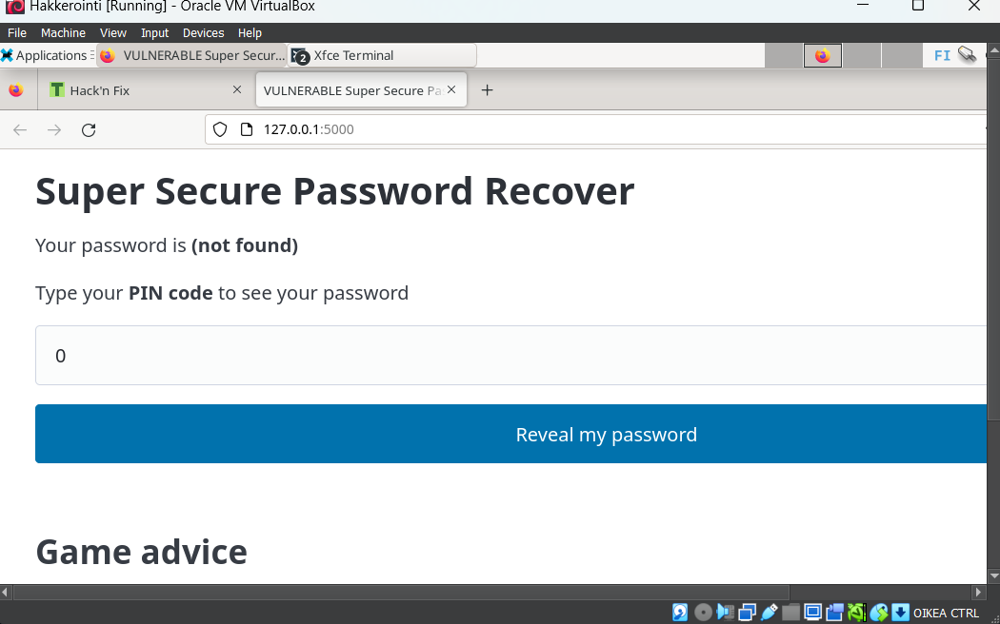
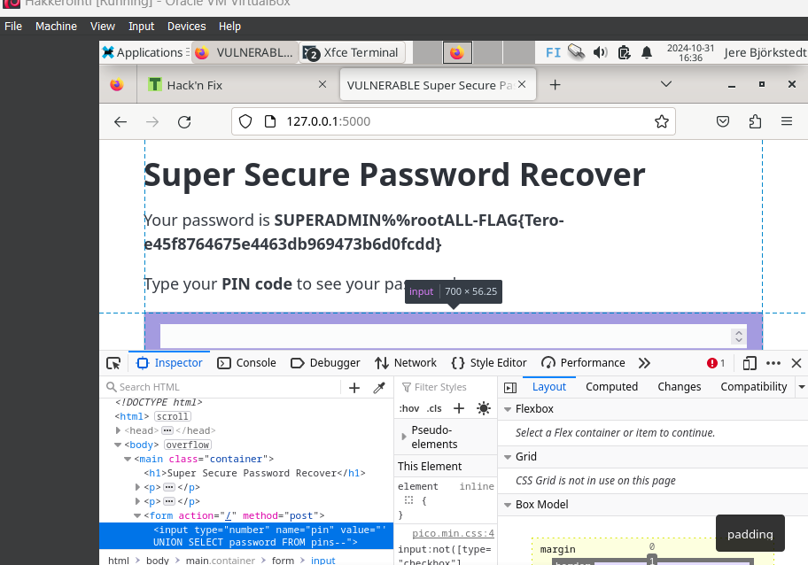
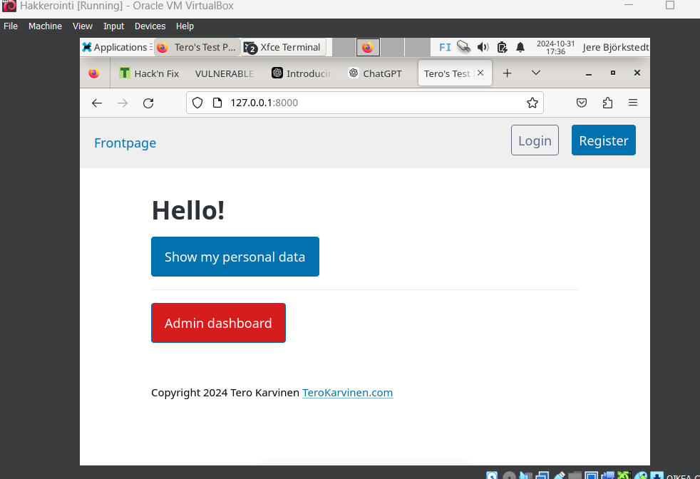

# H2 Break and unbreak
 
## x) Lue/katso/kuuntele ja tiivistä

### OWASP: [OWASP Top 10: A01 Broken Access Control](https://owasp.org/Top10/A01_2021-Broken_Access_Control/)
- Noin 94% ohjelmista kärsii joistakin pääsynhallinnan ongelmista.
- Yleisiä heikkouksia ovat mm. pääsynhallinnan kiertäminen URL-muokkauksilla, Pääsynhallinnan puutteet API-kutsujen POST-, PUT- ja DELETE-toiminnoissa ja mahdollisuus tarkastella tai muokata toisen käyttäjän tietoja.
- Pääsynhallinta toimii tehokkaasti vain luotetussa palvelinpuolen koodissa. Pääsy tulisi estää oletuksena, ottamatta huomioon julkisia resursseja. Vahvista myös tietueen omistajuus ja rajoita CORS-käyttöä.

### Karvinen 2023: [Find Hidden Web Directories - Fuzz URLs with ffuf](https://terokarvinen.com/2023/fuzz-urls-find-hidden-directories/)
- Web-palvelimilla on monesti salaisia hakemistoja, joita ei ole linkitetty mihinkään.
- Salaisia hakemistoja voi etsiä komennoilla kuten: /secret, /.svn ja /admin.
- Fuff on monipuolinen fuzzing työkalu. Sen avulla voidaan löytää piilotettuja hakemistoja. Sitä voi käyttää esim. otsikoiden ja POST-parametrien fuzzaukseen.

### PortSwigger: [Access control vulnerabilities and privilege escalation](https://portswigger.net/web-security/access-control)
- Pääsynhallinta tarkoittaa rajoituksia, sille kuka voi suorittaa tiettyjä toimintoja tai pääsee tiettyihin resursseihin.
- Verkkosovelluksissa pääsynhallinta perustuu autentikointiin ja istunnonhallintaan.
- Rikkoutuneet pääsynhallinnat ovat yleisiä ja usein vakavia tietoturvaongelmia. Pääsynhallinnan suunnittelupäätökset tehdään ihmisten toimesta, joten virheiden mahdollisuus on suuri.

### Karvinen 2006: [Raportin kirjoittaminen](https://terokarvinen.com/2006/raportin-kirjoittaminen-4/)
- Raportointi on sitä kun kirjoitat ja kerrot täsmällisesti mitä teit ja mitä tapahtui. Raporttia kannattaa kirjoittaa sitä mukaan kun toimit. 
- Hyvä raportti on toistettava, täsmälllinen, helppolukuinen ja siinä viitataan lähteisiin.

## Murtaudu 010-staff-only. Ks. Karvinen 2024: Hack'n Fix 

Aloitin lataamalla Teron haastepaketin:
 
    $ sudo apt-get update
    $ sudo apt-get -y install wget unzip micro
 

    $ wget https://terokarvinen.com/hack-n-fix/teros-challenges.zip
    $ unzip teros-challenges.zip

Seuraavaksi latasin seuraavat ohjelmat:

    $ sudo apt-get -y install python3-flask 
    $ sudo apt-get -y install python3-flask-sqlalchemy

Sitten navigoin seuraavaan kansioon ja avasin sen microlla:

    $ cd challenges/010-staff-only/
    $ micro python3 staff-only.py

Seuraavaksi avasin nettisivun:

    $ cd challenges/010-staff-only/
    $ cd 010-staff-only
    $ python3 staff-only.py

Kokeilin ensimmäisenä kirjoittaa kenttään sql-injektion "'or 1=1--" , mutta huomasin, ettei kenttään voi syöttää muuta kuin numeroita. Tämän jälkeen kokeilin inspect työkalua. Avasin sen painamalla "f12" ja kokeilin tyhjentää "type=" kohdan. Nyt pystyin syöttämään kenttään myös merkkejä. Syötin sinne uudelleen "' or 1=1--" ja sain "foo". Seuraavaksi luin lisää sql-injektioista. Luin UNION-hyökkäyksistä portswiggerin sivuilta ja löysin sieltä seuraavan komennon: 
         
         ' UNION SELECT username, password FROM users--

Kokeilin syöttää samankaltaisen komennon käyttämällä name kohtaa userin tilalla:

    ' UNION SELECT password FROM pins--

Sain ratkaistua tehtävän niin kuin kuvasta näkyy. 

## Korjaa 010-staff-only haavoittuvuus lähdekoodista. Osoita testillä, että ratkaisusi toimii. 

En osannut korjata koodia :(

## Ratkaise dirfuzt-1 artikkelista Karvinen 2023: Find Hidden Web Directories - Fuzz URLs with ffuf. 

Aloitin lataamalla esimerkki kohteen: 

     $ wget https://terokarvinen.com/2023/fuzz-urls-find-hidden-directories/dirfuzt-0
     $ chmod u+x dirfuzt-0
     $ ./dirfuzt-0 

## Murtaudu 020-your-eyes-only. Ks. Karvinen 2024

Aloitin siirtymällä oikeaan kansioon: 

    $ cd challenges/020-your-eyes-only/

Seuraavaksi latasin virtualenv:

    $ sudo apt-get -y install virtualenv
    $ virtualenv virtualenv/ -p python3 --system-site-packages

Sitten aktivoin virtualenv:

     $ source virtualenv/bin/activate

Sitten lisäsin djangon: 

     $ cat requirements.txt django==4.2.*

ja asensin sen:

     pip install -r requirements.txt

Siirryin kansioon, jossa on manage.py:
     
     $ cd logtin/

Päivitin tietokannan:

    $ ./manage.py makemigrations; ./manage.py migrate

Lopuksi laitoin serverin päälle: 

     $ ./manage.py runserver

 

## Lähteet
- OWASP. 2021. OWASP Top 10: A01 Broken Access Control. Luettavissa: https://owasp.org/Top10/A01_2021-Broken_Access_Control/ Luettu: 31.10.2024.
- Karvinen, T. 2023. Find Hidden Web Directories - Fuzz URLs with ffuf. Luettavissa: https://terokarvinen.com/2023/fuzz-urls-find-hidden-directories/ Luettu: 31.10.2024.
- PortSwigger. 2024. Access control vulnerabilities and privilege escalation. Luettavissa: https://portswigger.net/web-security/access-control Luettu: 31.10.2024.
- Karvinen, T. 2006. Raportin kirjoittaminen. Luettavissa: https://terokarvinen.com/2006/raportin-kirjoittaminen-4/ Luettu: 31.10.2024.
- Karvinen, T. 12.4.2024. Tehtävän anto. Luettavissa: https://terokarvinen.com/application-hacking/#h2-break--unbreak Luettu: 31.10.2024.
  
