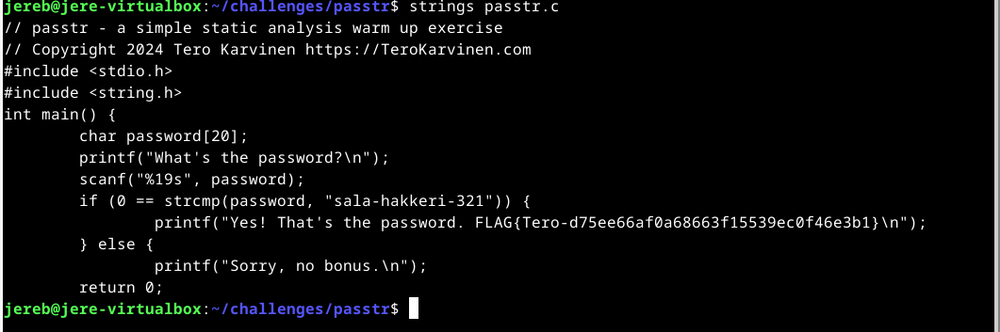

# H3 No Strings Attached

## Käyttöympäristö

Prosessori: AMD Ryzen 5 5500H

RAM: 8 GB DDR4

Näytönohjain: NVIVIA GeForce RTX 2050

OS: Windows 10

## a) Strings. Lataa ezbin-challenges.zip Aja 'passtr'. Selvitä oikea salasana 'strings' avulla. Selvitä myös lippu. (Ensisijaisesti katsomatta sorsia, jos osaat.) 

Aloitin lataamalla zip-tiedoston: (7.11.2024 klo. 18.30)

      $ sudo apt-get update
      $ wget https://terokarvinen.com/loota/yctjx7/ezbin-challenges.zip
      unzip ezbin-challenges.zip

Seuraavaksi selvitin mitä 'strings' tarkoittaa [ChatGPT:n](https://chatgpt.com/) avulla. Selvisi, että työkalun avulla voi selvittää mitä tekstijonoja tietty tiedosto sisältää. Ajoin seuraavan komennon: 

            $ strings passtr.c

    

Komennon avulla saatiin selville, että oikea salasana on 'sala-hakkeri-321' ja Kuvassa näkyy myös lippu, joka piti etsiä. (7.11.2024 klo. 18.08)

## b) Tee passtr.c -ohjelmasta uusi versio, jossa salasana ei näy suoraan sellaisenaan binääristä. Osoita testillä, että salasana ei näy. (Obfuskointi riittää.) 

Aloitin selvittämällä miltä koodi oikein näyttää. Suoritin komennon: (7.11.2024 klo. 18.10)

      $ micro passtr.c

Seuraavaksi aloitin tutkimaan miten koodi oikeastaan toimii. Minulla ei ollut aluksi mitään hajua kuinka lähteä muokkaamaan koodia. Joten kysyin [ChatGPT:ltä](https://chat.openai.com/) mitä voisi kokeilla. Se ehdotti käyttää xor-operaatiota salasanan suojaamiseen, joten rupesin tutkimaan asiaa. Minulle selvisi, että xor-operaation tulos on aina joko 0 eli true tai 1 eli false. Netissä asian tutkiminen ei kuitenkaan auttanut minua juuri yhtään joten päätin turvuatua jälleen kerran [Chat GPT:een](https://chat.openai.com/) 

## Lähteet

- Karvinen. T. 12.4.2024. Tehtävänanto. h3 No strings attached. Luettavissa: https://terokarvinen.com/application-hacking/#h3-no-strings-attached Luettu: 7.11.2024
- OpenAI. (2024). ChatGPT. Saatu 7.11.2024. Luettavissa: https://chat.openai.com/ Luettu 7.11.2024.
