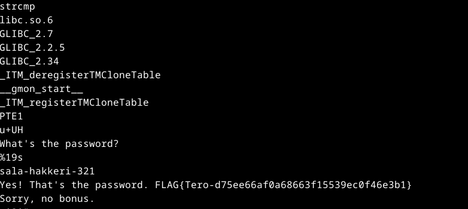
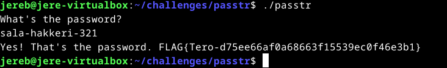
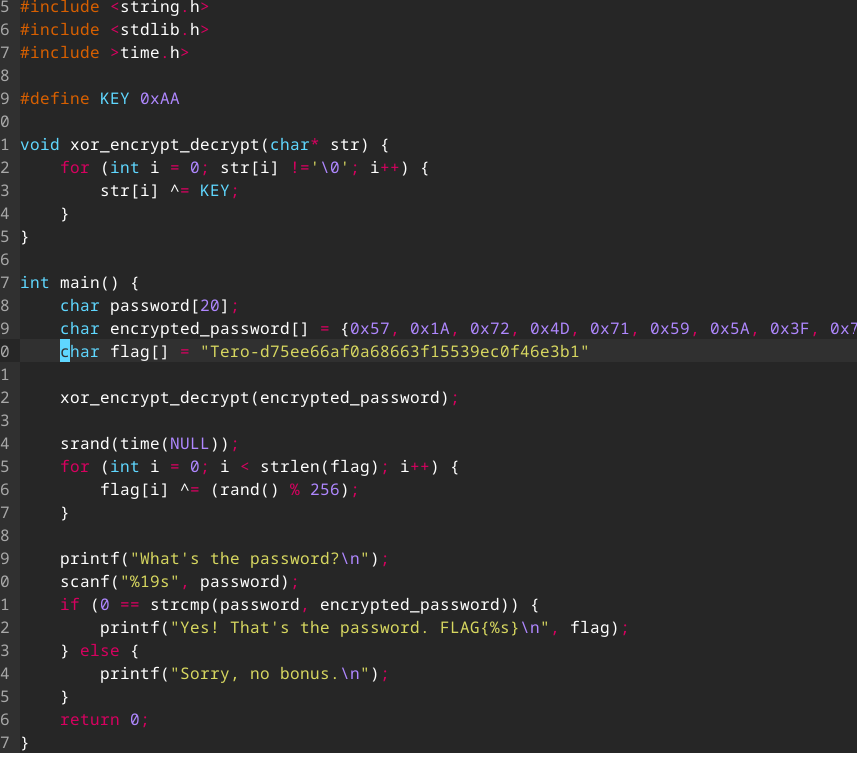
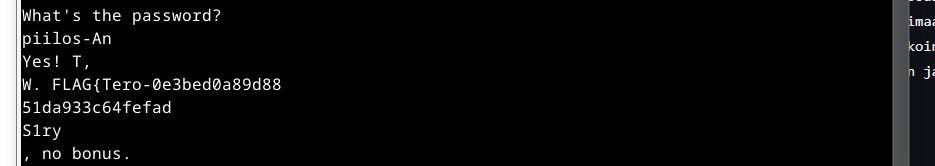

# H3 No Strings Attached

## Käyttöympäristö

Prosessori: AMD Ryzen 5 5500H

RAM: 8 GB DDR4

Näytönohjain: NVIVIA GeForce RTX 2050

OS: Windows 10

## a) Strings. Lataa ezbin-challenges.zip Aja 'passtr'. Selvitä oikea salasana 'strings' avulla. Selvitä myös lippu. (Ensisijaisesti katsomatta sorsia, jos osaat.) 

Aloitin lataamalla zip-tiedoston: (7.11.2024 klo. 18.30)

      $ sudo apt-get update
      $ wget https://terokarvinen.com/loota/yctjx7/ezbin-challenges.zip
      unzip ezbin-challenges.zip

Seuraavaksi selvitin mitä 'strings' tarkoittaa [ChatGPT:n](https://chatgpt.com/) avulla. Selvisi, että työkalun avulla voi selvittää mitä tekstijonoja tietty tiedosto sisältää. Ajoin seuraavan komennon: 

            $ strings passtr

## b) Tee passtr.c -ohjelmasta uusi versio, jossa salasana ei näy suoraan sellaisenaan binääristä. Osoita testillä, että salasana ei näy. (Obfuskointi riittää.) 

Aloitin selvittämällä miltä koodi oikein näyttää. Suoritin komennon: (7.11.2024 klo. 18.10)

      $ micro passtr.c

Sieltä löytyi mielenkiintoisia sanoja! Voisikohan olla, että siinä on etsimäni salasana sekä flagi. Testasin vielä ajaa ohjelman ja syöttää salasanan.

      $ ./passtr

Kuvassa näkyy oikea salasana sekä lippu.

## Tee passtr.c -ohjelmasta uusi versio, jossa salasana ei näy suoraan sellaisenaan binääristä. Osoita testillä, että salasana ei näy. (Obfuskointi riittää.) 

Seuraavaksi aloitin tutkimaan miten koodi oikeastaan toimii. Minulla ei ollut aluksi mitään hajua kuinka lähteä muokkaamaan koodia. Joten kysyin [ChatGPT:ltä](https://chat.openai.com/) mitä voisi kokeilla. Se ehdotti käyttää xor-operaatiota salasanan suojaamiseen, joten rupesin tutkimaan asiaa. Netissä asian tutkiminen ei kuitenkaan auttanut minua juuri yhtään joten päätin turvautua jälleen kerran [Chat GPT:een](https://chat.openai.com/) (Jatkoin tehtävää 8.11.2024 klo.8.11.) En saanut ratkaistua tehtävää. Hyödynsin tehtävässä tällaista xor-salausta, mutta strings-komennolla pystyi silti löytämään lipun ja salasanan todella helposti.

##  Packd. Aja 'packd' paketista ezbin-challenges.zip. Mikä on salasana? Mikä on lippu? (Tämä tehtävä on hieman haastavampi. Kirjaa ylös kokeilemasi lähestymistavat ja keksimäsi hypoteesit. Toivottavasti pääset itse maaliin, mutta jos et, läpikävely paljastuu tunnilla...) 

Aloitin ajamalla 'packd' ohjelman:

      $ cd challenges/packd/
      $ ./packd
      
Kokeilin syöttää salasanaksi satunnaisia kirjaimia, mutta ei mennyt läpi. Seuraavaksi kokeilin mitä saisin irti strings-komennon avulla:

      $ strings packd

 

Kaikkien sanojen seasta nuo pistivät silmään, joten päätin kokeilla ajaa ohjelman uudestaan ja kokeilla onneani. Salasana ei kuitenkaan toiminut, siinä on selvästi vain osa lippua ja salasanaa. Sitten yritin pitkään tutkia asiaa netistä sekä chatGPT:n avulla. Se jossain vaiheessa puhui "buffer overflowista" Luin siitä lisää ja yritin tämän jälkeen syöttää ohjelmaan yli sata satunnaista merkkiä ja sitten ajoin strings komennon uudelleen ja sain tälläisen: 

## Lähteet

- Karvinen. T. 12.4.2024. Tehtävänanto. h3 No strings attached. Luettavissa: https://terokarvinen.com/application-hacking/#h3-no-strings-attached Luettu: 7.11.2024
- OpenAI. (2024). ChatGPT. Saatu 7.11.2024. Luettavissa: https://chat.openai.com/ Luettu 7.11.2024.
