# H4 Kääntöpaikka

## Käyttöympäristö

Prosessori: AMD Ryzen 5 5500H

RAM: 8 GB DDR4

Näytönohjain: NVIVIA GeForce RTX 2050

OS: Windows 10

## x) Lue/katso/kuuntele ja tiivistä. (Tässä x-alakohdassa ei tarvitse tehdä testejä tietokoneella, vain lukeminen tai kuunteleminen ja tiivistelmä riittää. Tiivistämiseen riittää muutama ranskalainen viiva.) 

Katsoin [(John Hammond, 2022)](https://www.youtube.com/watch?v=oTD_ki86c9I) -videon käänteissuunnittelusta ghidralla. (14.11.2024)

- Ghidraa on avoimen lähdekoodin ohjelmistopaketti jota käytetään ohjelmien analysointiin ja käänteiseen suunnitteluun.
- Ghidrassa on graafinen käyttölittymä, jota vaikuttaisi olevan suhteellisen helppo käyttää, vaikka siinä on paljon eri ominaisuuksia.

## a) Asenna Ghidra. 

Aloitin lataamalla Ghidran lähdekoodin githubista ja siirryin 'Downloads' - kansioon:

    $ cd Downloads

Siirsin ghidra zip-tiedoston käyttäjä kansioon ja purin sen:

    $ mv ghidra-master.zip /home/jereb/
    $ unzip ghidra-master.zip

Seuraavaksi tarkistin java version.

    $ java -version

Sain kuitenkin 'command not found' Joten latasin JDK 17:

    $ sudo apt-get update
    $ sudo apt install openjdk-17-jdk

Yritin käynnistää ohjelmaa mutta en ollut asentanut vielä gradlea joten asensin sen:

    $ sudo apt install gradle

Seuraavaksi yritin buildata gradlella:

    $ ./gradlew build

Se ei kuitenkaan onnistunut joten katsoin error logeja ja hyödynsin ChatGPT 3.5-kielimallin apua. Kysyin mistä error log johtuu. Sitten Asensin python3-pipin, tein FlatRepon ja nano-tiedoston 'ghidra-repos-config' ja linkitin sinne mavenRepon url:än. En siltikään saanut buildausta toimimaan, joten aloin miettimään onko minulla oikea ghidran versio ladattuna. Päätin poistaa nykyisen ja ladata uuden sillä huomasin tehtävän annon vinkeissä olevan versio 11.1.2: 

    $ wget https://github.com/NationalSecurityAgency/ghidra/releases/download/Ghidra_11.1.2_build/ghidra_11.1.2_PUBLIC_20240709.zip 
    $ unzip ghidra_11.1.2_PUBLIC_20240709.zip

Sitten kokeilin käynnistää ghidran:

    $ cd ghidra_11.1.2_PUBLIC_20240709
    $ ./ghidraRun

Sain ohjelman vihdoin käyntiin aivan turhan säätämisen jälkeen: 

    
## b) rever-C. Käänteismallinna packd-binääri C-kielelle Ghidralla. Etsi pääohjelma. Anna muuttujielle kuvaavat nimet. Selitä ohjelman toiminta. Ratkaise tehtävä binääristä, ilman alkuperäistä lähdekoodia. ezbin-challenges.zip

Aloitin käynnistämällä ghidran:

        $ cd ghidra_11.1.2_PUBLIC_20240709
        $ ./ghidraRun

Seuraavaksi loin ghidrassa uuden projektin nimeltä 'unpackd' ja avasin code browserin: 

Seuraavaksi rupesin seuraamaan hieman [(John Hammond, 2022)](https://www.youtube.com/watch?v=oTD_ki86c9I) -videota saadakseni vinkkejä softan käyttöön. Tehtävänantona oli aluksi etsiä pääohjelma joten etsin sen ihan ensimmäisenä. Pääohjelma löytyi aika näppärästi kun siirryin 'defined strings' toimintoon: 

Tässä vielä pääohjelma decompilattuna: 

Kun lähdin miettimään muuttujien nimiä ensimmäisenä silmään pisti 'local_28' Mielestäni tämä voisi olla esim. 'password' tai syöte eli 'input'. 'iVar1' on muuttuja joka tarkastaa funktiossa, että onko salasana oikein vai ei. Nimesin sen 'compare'. Tältä näyttää korjattu koodi: 

Ohjelma siis toimii siten, että se kysyy käyttäjältä salasanaa. Käyttäjän syötön jälkeen ohjelma vertaa käyttäjän salasanaa oikeaan salasanaan ja päättää, että onko se sama vai ei. Jos se on sama ohjelma tulostaa "Yes! That's the password" + flagi. Jos se on väärin ohjelma tulostaa "Sorry, no bonus". En tiedä ymmärsinkö oikein, mutta tehtävän ratkaisu eli salasana näkyy ghidrassa suoraan eli "piilos-AnAnAs", joten suoritin 'packd' ohjelman ja syötin salasanan: 

## c) Jos väärinpäin. Muokkaa passtr-ohjelman binääriä (ilman alkuperäistä lähdekoodia) niin, että se hyväksyy kaikki salasanat paitsi oikean. Osoita testein, että ohjelma toimii. ezbin-challenges.zip 

Aloitin importtaamalla passtr-tiedoston ghidran code browseriin. Seuraavaksi avasin pääohjelman: 

 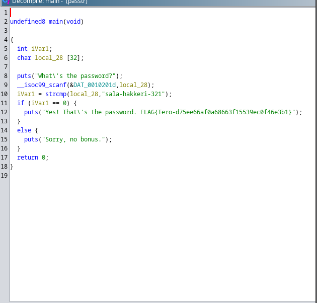

Yritin aluksi muokata pääohjelmaa, mutta tajusin, että ainut asia mitä siinä voi tehdä on vaihtaa muuttujien nimiä joten aloin etsimään tietoa netistä. Satuin löytämään tälläisen [Wolter, J. 2022](https://jorianwoltjer.com/blog/p/hacking/introduction-to-reverse-engineering-with-ghidra) - nettisivun, josta löysin tietoa kuinka muokata if-lausetta. Kohdassa "Patching assembly instructions" luki kuinka if lauseen ehtoja voi muokata vaihtamalla 'JNZ' eli "jump if not zero" muotoon 'JZ' eli "jump if zero", joten kokeilin tätä. Tässä muokattu versio: 

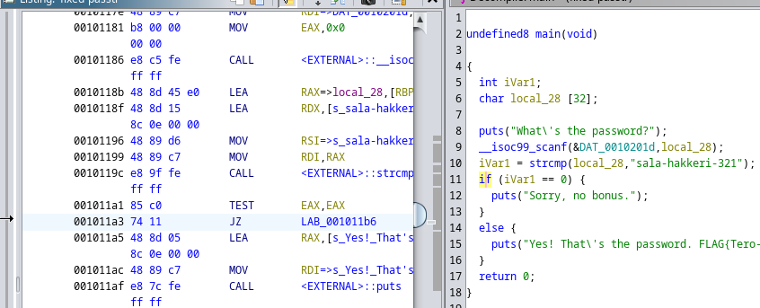

Sitten tallensin ohjelman ja kokeilin toimiiko se. Yritin ajaa ohjelmaa komennolla:

        $ ./fixed-passtr

Sain permission denied, joten annoin oikeudet. 

        $ chmod +x fixed-passtr

Sitten ajoin ohjelman uudelleen ja kokeilin syöttää ns "oikean salasanan":

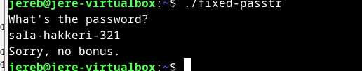

Kokeilin vielä antaako ohjelma lipun millä tahansa muulla salasanalla: 

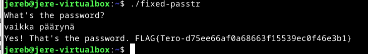

Näytti toimivan :D

## d) Nora CrackMe: Käännä binääreiksi Tindall 2023: NoraCodes / crackmes. Lue README.md: älä katso lähdekoodeja, ellet tarvitse niitä apupyöriksi. Näissä tehtävissä binäärejä käänteismallinnetaan. Binäärejä ei muokata, koska muutenhan jokaisen tehtävän ratkaisu olisi vaihtaa palautusarvoksi "return 0". 

Aloitin lataamalla (NoraCodes) zip-tiedoston. (15.11.2024)

        $ wget https://github.com/NoraCodes/crackmes/archive/refs/heads/master.zip
        $ mv crackmes-master.zip /home/jereb
        $ unzip crackmes-master.zip

### crackme01

Seuraavaksi siirryin tehtävä kansioon ja suoritin komennon 'make crackme01', jolla sain tehtyä ohjelman 'crackme01.64' Päätin ajaa ohjelman:

        $ ./crackme01.64

Sain tulokseksi "Need exactly one argument", joten yritin syöttää siihen perään jotain sanoja. 

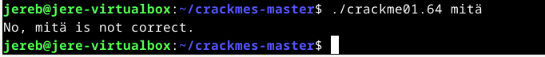

Ei ollut oikea ratkaisu, joten kokeilin mitä saan strings komennolla. 

        $ strings crackme01.64

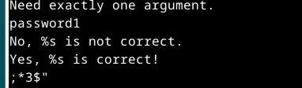

Sieltä löytyi mahdollinen salasana, joten kokeilin toimiiko se: 

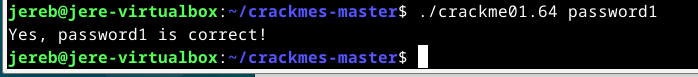

### Nora crackme01e 

Aloitin Tekemällä ohjelmasta ajokelpoisen:

        $ make crackme01e

Seuraavaksi ajoin ohjelman: 

        $ ./crackme01e.64

Sain vastaukseksi saman kuin ensimmäisessäkin eli "Need exactly one argument", joten päätin kokeilla uudelleen stringsiä:

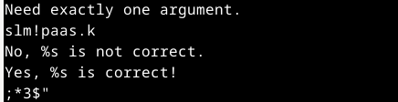

Sieltä löytyi jotain, mutta en usko, että se on oikea. Testasin kuitenkin: 

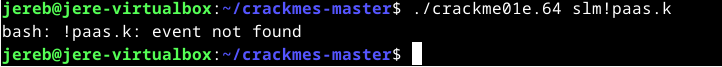

Sitten päätin mennä tappelemaan ghidran kanssa. Loin uuden projektin ja importtasin crackme01e.64 ohjelman sinne. Etsin main funktionin ja muokkasin muuttutjien nimiä:

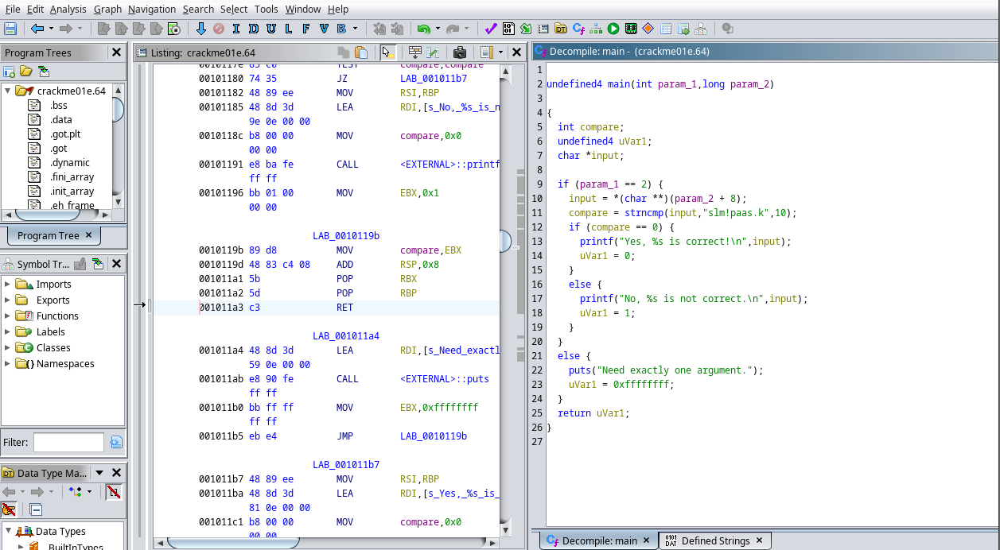

Koodistä voisi nyt päätellä, että ohjelma vertaa käyttäjän inputtia stringiin ""slm!paas.k"", ohjelmassa ei näyttäisi olevan muita kryptaus menetelmiä joten testasin ajaa ohjelmaa uudelleen ja testata sanaa ajamisen yhteydessä. 

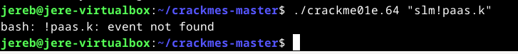

Ei näyttänyt toimivan. Sain tulosteeksi "bash: !paas.k: event not found" Mielestäni tämä oli outoa, sillä ohjelmassa lukee selvästi, että se vertaa käyttäjän syötettä ""slm!paas.k"". Päätin kysyä chatGPT 3.5 kielimallilta, että mitä tämä "bash: !paas.k: event not found" tarkoittaa. Tekoälyn mukaan bash käsittelee "!" erikoismerkiksi. Tämän takia se yrittää estää suoritettua komentoa. Tekoäly ehdotti kokeilla "slm\!paas.k", joten kokeilin sitä:

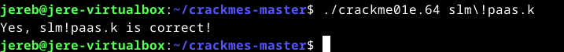

Ja sieltä löytyi oikea ratkaisu!

### Nora crackme02. Nimeä pääohjelman muuttujat käänteismallinnetusta binääristä ja selitä ohjelman toiminta. Ratkaise binääri. 

Aloitin luomalla crackme02 tiedostosta ajettavan ohjelman: 

        $ make crakcme02

Ajoin ohjelman ja ohjelma oli samanlainen kuin kaksi aiempaakin ohjelmaa. Seuraavaksi siirryin ghidran puolelle. Importtasin crackme02 ja etsin main funktion. Tuijottelin koodia jonkun aikaa ja en oikein osannut nimetä muuttujia, joten kysyin ChatGPT 3.5 kielimallilta, että mitä muuttujia ohjelmassa on. Sain vastaukseksi:

- cVar1 = Yksittäinen merkki syötteestä, jota verrataan salasanan merkkeihin
- cVar2 = Salasana oikea merkki, joka toimii vertailuiarvona
- uVar3 = 64-bittinen muuttuja, joka palauttaa ohjelman lopuksi arvot 0 tai 0xffffffff
- lVar4 = Laskuri, joka pitää kirjaa kuinka monta merkkiä on verrattu.

Tässä vielä uudelleen nimetyt muuttujat: 

Kuvasta näkyy, että 'cVar2' = 'p' , joten se on ainakin yksi oikea merkki salasanasta. Ohjelma näyttäisi toimivan siten, että se vertaa käyttäjän syöttämiä merkkejä oikeisiin merkkeihin ja sen kautta päättää tulostaako ohjelma true vai false. Jos ohjelma palauttaa arvon 0 se tulostaa "Yes %s is correct!\n" jos se palauttaa arvon 1 ohjelma tulostaa syötteen "No %s is not correct.\n". Koodia tutkimalla selviää, että siellä on rivi "cVar2 = "password1"[lVar4 + 1]" jota ilmeisesti verrataan käyttäjän syötteeseen merkki kerrallaan jonka perusteella ohjelma päättää tulostuksen. Oikea salasana siis on luultavasti tuo "password1" Päätin kokeilla sitä:

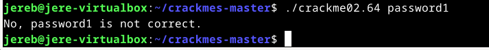

Ei ollut oikein. 

## Lähteet
- Karvinen, T. 13.11.2024. Tehtävänanto. h4 Kääntöpaikka. Luettavissa: https://terokarvinen.com/application-hacking/#h4-kaantopaikka Luettu: 14.11.2024
- NationalSecurityAgency. 9.7.2024. Ghidra 11.1.2. Luettavissa:  https://github.com/NationalSecurityAgency/ghidra/releases/tag/Ghidra_11.1.2_build Luettu: 14.11.2024.
- Wolter, J. 2022. Introduction to Reverse Engineering (with Ghidra) Luettavissa: https://jorianwoltjer.com/blog/p/hacking/introduction-to-reverse-engineering-with-ghidra#3-changing-instructions-with-ghidra Luettu: 14.11.2024.

    
