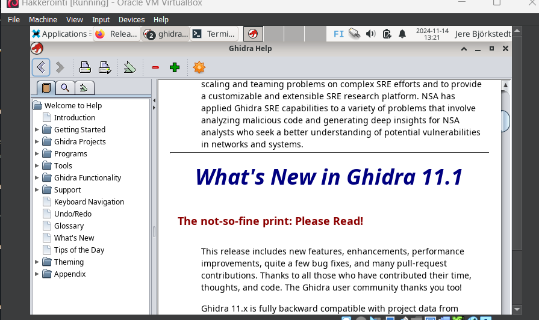
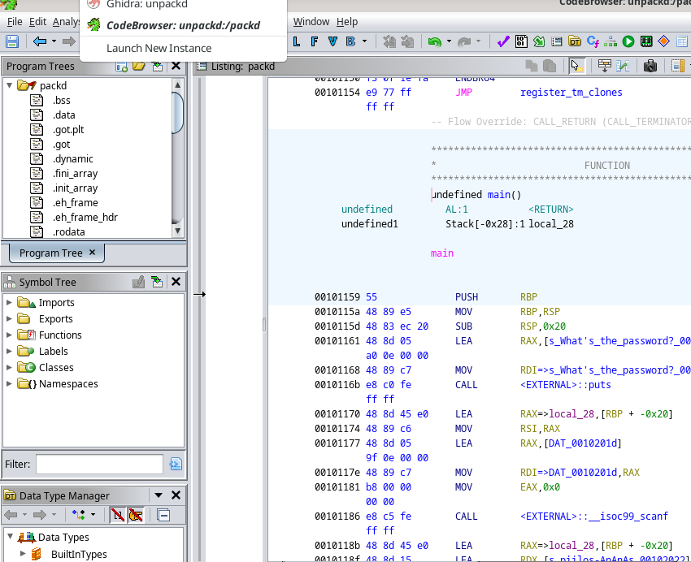
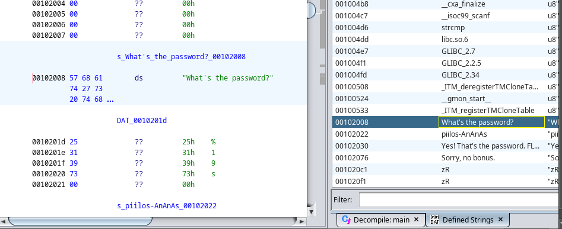
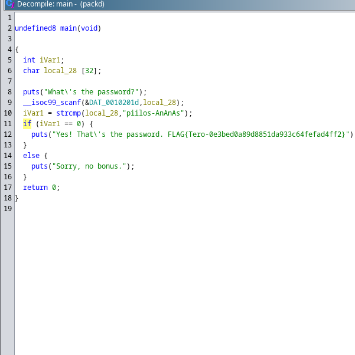
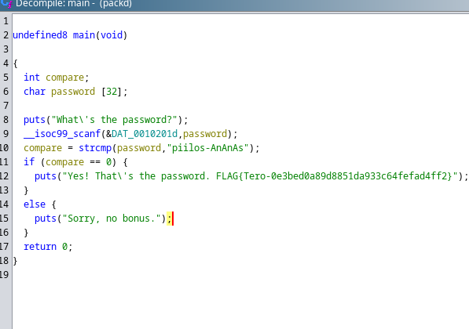
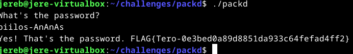

# H4 Kääntöpaikka

## Käyttöympäristö

Prosessori: AMD Ryzen 5 5500H

RAM: 8 GB DDR4

Näytönohjain: NVIVIA GeForce RTX 2050

OS: Windows 10

## x) Lue/katso/kuuntele ja tiivistä. (Tässä x-alakohdassa ei tarvitse tehdä testejä tietokoneella, vain lukeminen tai kuunteleminen ja tiivistelmä riittää. Tiivistämiseen riittää muutama ranskalainen viiva.) 

Katsoin [(John Hammond, 2022)](https://www.youtube.com/watch?v=oTD_ki86c9I) -videon käänteissuunnittelusta ghidralla. 

- Ghidraa on avoimen lähdekoodin ohjelmistopaketti jota käytetään ohjelmien analysointiin ja käänteiseen suunnitteluun.
- Ghidrassa on graafinen käyttölittymä, jota vaikuttaisi olevan suhteellisen helppo käyttää, vaikka siinä on paljon eri ominaisuuksia.

## a) Asenna Ghidra. 

Aloitin lataamalla Ghidran lähdekoodin githubista ja siirryin 'Downloads' - kansioon:

    $ cd Downloads

Siirsin ghidra zip-tiedoston käyttäjä kansioon ja purin sen:

    $ mv ghidra-master.zip /home/jereb/
    $ unzip ghidra-master.zip

Seuraavaksi tarkistin java version.

    $ java -version

Sain kuitenkin 'command not found' Joten latasin JDK 17:

    $ sudo apt-get update
    $ sudo apt install openjdk-17-jdk

Yritin käynnistää ohjelmaa mutta en ollut asentanut vielä gradlea joten asensin sen:

    $ sudo apt install gradle

Seuraavaksi yritin buildata gradlella:

    $ ./gradlew build

Se ei kuitenkaan onnistunut joten katsoin error logeja ja hyödynsin ChatGPT 3.5-kielimallin apua. Kysyin mistä error log johtuu. Sitten Asensin python3-pipin, tein FlatRepon ja nano-tiedoston 'ghidra-repos-config' ja linkitin sinne mavenRepon url:än. En siltikään saanut buildausta toimimaan, joten aloin miettimään onko minulla oikea ghidran versio ladattuna. Päätin poistaa nykyisen ja ladata uuden sillä huomasin tehtävän annon vinkeissä olevan versio 11.1.2: 

    $ wget https://github.com/NationalSecurityAgency/ghidra/releases/download/Ghidra_11.1.2_build/ghidra_11.1.2_PUBLIC_20240709.zip 
    $ unzip ghidra_11.1.2_PUBLIC_20240709.zip

Sitten kokeilin käynnistää ghidran:

    $ cd ghidra_11.1.2_PUBLIC_20240709
    $ ./ghidraRun

Sain ohjelman vihdoin käyntiin aivan turhan säätämisen jälkeen: 

    
## b) rever-C. Käänteismallinna packd-binääri C-kielelle Ghidralla. Etsi pääohjelma. Anna muuttujielle kuvaavat nimet. Selitä ohjelman toiminta. Ratkaise tehtävä binääristä, ilman alkuperäistä lähdekoodia. ezbin-challenges.zip

Aloitin käynnistämällä ghidran:

        $ cd ghidra_11.1.2_PUBLIC_20240709
        $ ./ghidraRun

Seuraavaksi loin ghidrassa uuden projektin nimeltä 'unpackd' ja avasin code browserin: 

Seuraavaksi rupesin seuraamaan hieman [(John Hammond, 2022)](https://www.youtube.com/watch?v=oTD_ki86c9I) -videota saadakseni vinkkejä softan käyttöön. Tehtävänantona oli aluksi etsiä pääohjelma joten etsin sen ihan ensimmäisenä. Pääohjelma löytyi aika näppärästi kun siirryin 'defined strings' toimintoon: 

Tässä vielä pääohjelma decompilattuna: 

Kun lähdin miettimään muuttujien nimiä ensimmäisenä silmään pisti 'local_28' Mielestäni tämä voisi olla esim. 'password'. 'iVar1' on muuttuja joka tarkastaa funktiossa, että onko salasana oikein vai ei. Nimesin sen 'compare'. Tältä näyttää korjattu koodi: 

Ohjelma siis toimii siten, että se kysyy käyttäjältä salasanaa. Käyttäjän syötön jälkeen ohjelma vertaa käyttäjän salasanaa oikeaan salasanaan ja päättää, että onko se sama vai ei. Jos se on sama ohjelma tulostaa "Yes! That's the password" + flagi. Jos se on väärin ohjelma tulostaa "Sorry, no bonus". En tiedä ymmärsinkö oikein, mutta tehtävän ratkaisu eli salasana näkyy ghidrassa suoraan eli "piilos-AnAnAs", joten suoritin 'packd' ohjelman ja syötin salasanan: 

## c) Jos väärinpäin. Muokkaa passtr-ohjelman binääriä (ilman alkuperäistä lähdekoodia) niin, että se hyväksyy kaikki salasanat paitsi oikean. Osoita testein, että ohjelma toimii. ezbin-challenges.zip 

Aloitin importtaamalla passtr-tiedoston ghidran code browseriin. Seuraavaksi avasin pääohjelman: 

 

## Lähteet
- Karvinen, T. 13.11.2024. Tehtävänanto. h4 Kääntöpaikka. Luettavissa: https://terokarvinen.com/application-hacking/#h4-kaantopaikka Luettu: 14.11.2024
- NationalSecurityAgency. 9.7.2024. Ghidra 11.1.2. Luettavissa:  https://github.com/NationalSecurityAgency/ghidra/releases/tag/Ghidra_11.1.2_build Luettu: 14.11.2024.

    
