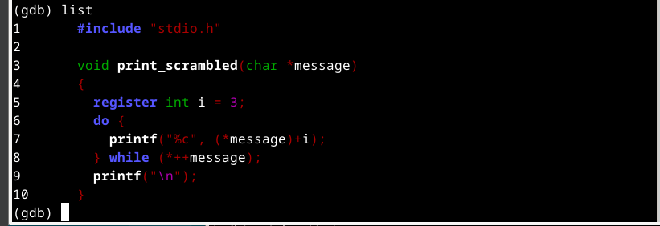
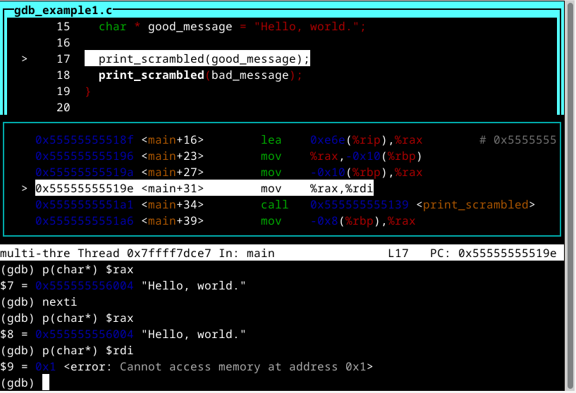
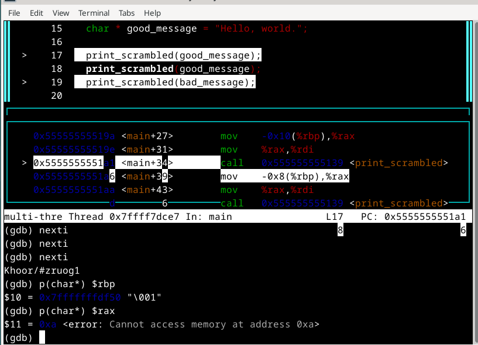
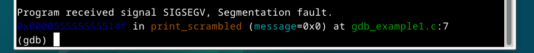

## H5 Se elää!

## Käyttöympäristö

Prosessori: AMD Ryzen 5 5500H

RAM: 8 GB DDR4

Näytönohjain: NVIVIA GeForce RTX 2050

OS: Windows 10

## a) Lab1. Tutkiminen mikä on ohjelmassa vialla ja miten se korjataan. lab1.zip 

Aloitin lataamalla 'lab1' zip-tiedoston ja siirsin sen käyttäjä kansioon. Sen jälkeen ihan ensimmäiseksi kokeilin mitä ohjelma tekee kun sen ajaa: 

    $ ./gdb_example1

En oikein ymmärtänyt mitä tuo tarkoitti, joten aloin debuggamaan ohjelmaa tunnilla käytyjen ohjeiden mukaan. Käänsin ohjelman ja avasin debuggaus ohjelman komennoilla:

    $ gcc gdb_example1.c -g -Wall -Werror -o example1-gdb
    $ gdb example1-gdb 
    

Aloitin debuggauksen siirtymällä 'layout split' näkymään, jossa sitten pläräsin koodia eteenpäin: 

    $ break main
    $ run
    $ p(char*) $(esim rdi)
    $ nexti

Mennessäni eteenpäin ohjelmassa huomasin yhden error viestin joka näkyy kuvassa: 

Tässä kohtaan päätin vielä siirtyä eteenpäin ja katsoa mitä tapahtuu.

 

Ohjelma antaa omituisia arvoja joita minulla oli hankaluuksia ymmärtää. Selasin silti vielä eteenpäin: 

