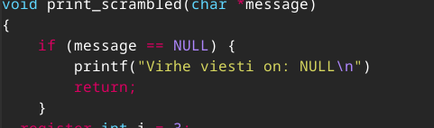
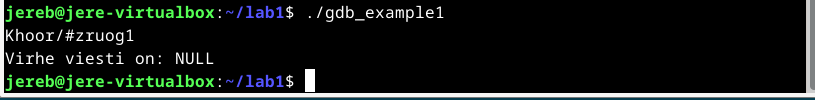
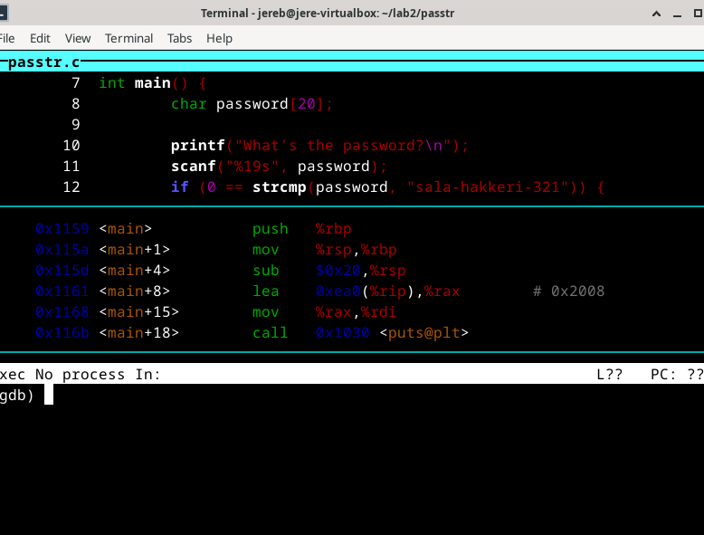

## H5 Se elää!

## Käyttöympäristö

Prosessori: AMD Ryzen 5 5500H

RAM: 8 GB DDR4

Näytönohjain: NVIVIA GeForce RTX 2050

OS: Windows 10

## a) Lab1. Tutkiminen mikä on ohjelmassa vialla ja miten se korjataan. lab1.zip 

Aloitin lataamalla 'lab1' zip-tiedoston ja siirsin sen käyttäjä kansioon. Sen jälkeen ihan ensimmäiseksi kokeilin mitä ohjelma tekee kun sen ajaa: 

    $ ./gdb_example1

En oikein ymmärtänyt mitä tuo tarkoitti, joten aloin debuggamaan ohjelmaa tunnilla käytyjen ohjeiden mukaan. Käänsin ohjelman ja avasin debuggaus ohjelman komennoilla:

    $ gcc gdb_example1.c -g -Wall -Werror -o example1-gdb
    $ gdb example1-gdb 
    

Aloitin debuggauksen siirtymällä 'layout split' näkymään, jossa sitten pläräsin koodia eteenpäin: 

    $ break main
    $ run
    $ p(char*) $(esim rdi)
    $ nexti

Mennessäni eteenpäin ohjelmassa huomasin yhden error viestin joka näkyy kuvassa: 

Tässä kohtaan päätin vielä siirtyä eteenpäin ja katsoa mitä tapahtuu.

 

Ohjelma antaa omituisia arvoja joita minulla oli hankaluuksia ymmärtää. Selasin silti vielä eteenpäin: 

Jos ymmärrän kuvaa oikein niin ongelma on rivillä 7, joten lähdin tutkimaan koodia micro editorissa: 

    $ micro gdb_example1.c

Päätin lähteä googlaamaan mitä 'segmentation fault' oikein tarkoittaa. (Samer, M. 2023) mukaan segmentation fault on virhe kun ohjelma yrittää päästä käsiksi muistiin johon sillä ei ole oikeuksia. Koska ohjelmassa on annettu 'bad_messagen' arvoksi 'NULL' ohjelma ei toimi oletetulla tavalla. Tein koodiin seuraavat korjaukset: 

Eli jos viestin arvo on "NULL" ohjelma palauttaa sen oikein eikä hajoa: 

## b) Lab2. Selvitä salasana ja lippu + kirjoita raportti siitä miten aukesi. lab2.zip 

Latasin ensin tiedoston ja purin zip-tiedoston. Seuraavaksi käänsin ohjelman ja ajoin debuggerin: 

    $ gcc passtr.c -g -Wall -Werror -o passtr1
    $ gdb passtr1
    $ layout split

## Lähteet

- Samer,M. 30.8.2023. Medium. Understanding Segmentation Fault in C: Causes and Solutions. Luettavissa: https://medium.com/@mohamedsamer1532/understanding-segmentation-fault-in-c-causes-and-solutions-ed3d1c159d76 Luettu: 22.11.2024. 
