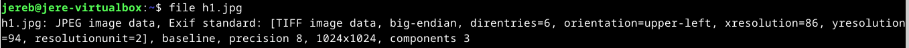
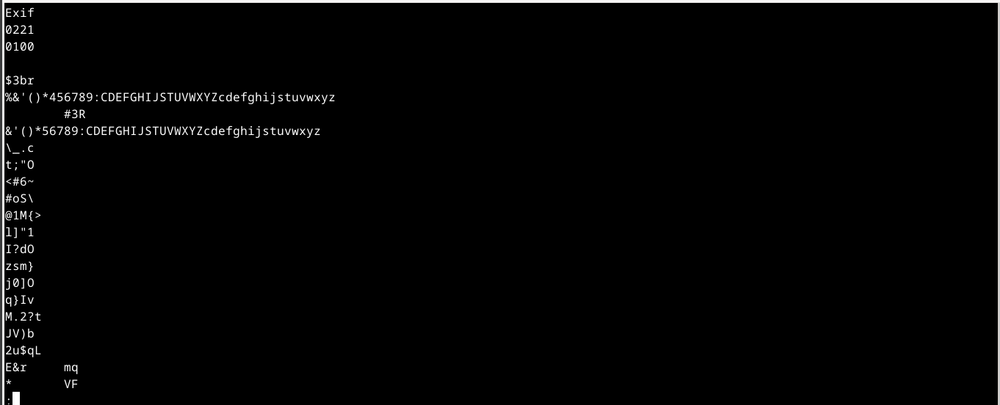
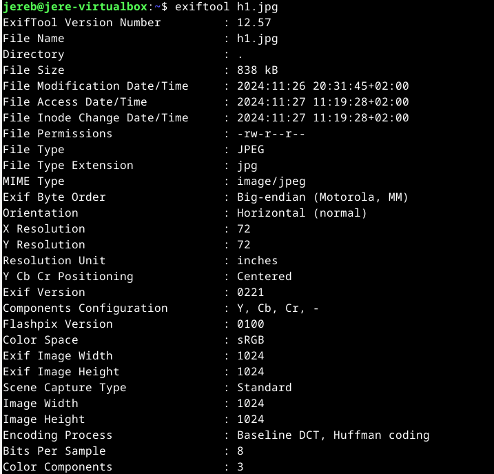
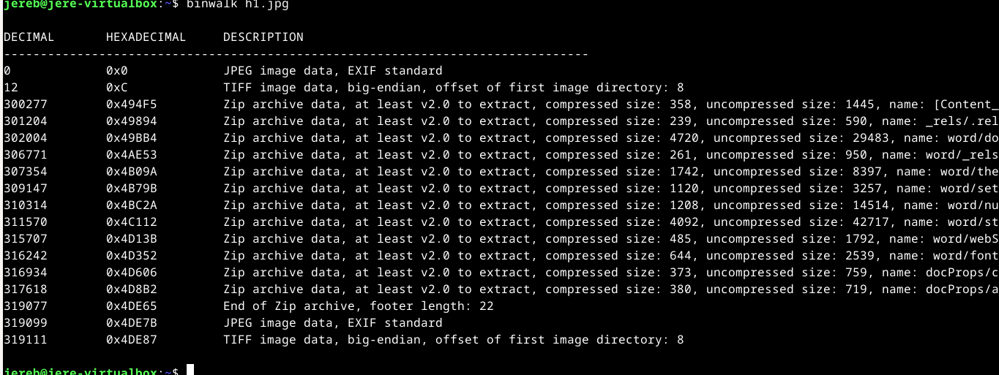
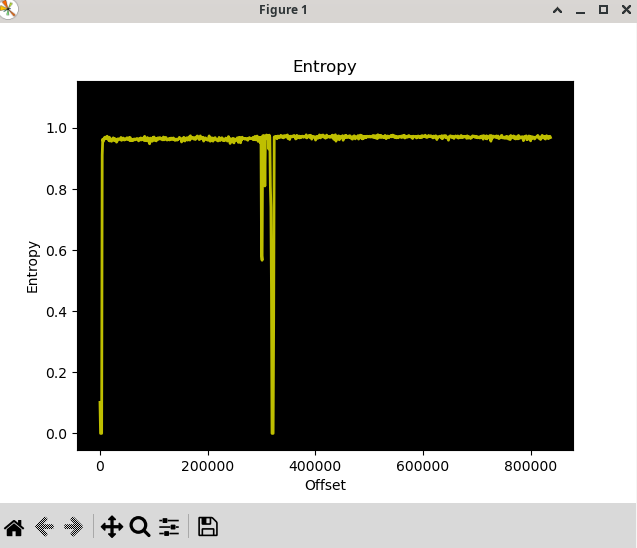
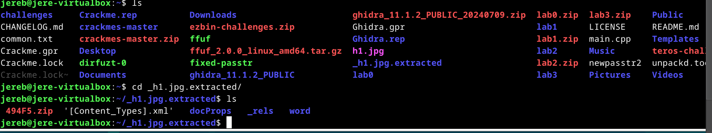
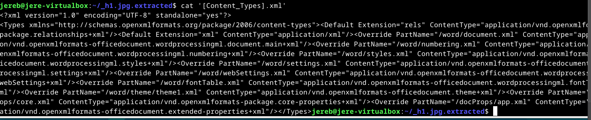
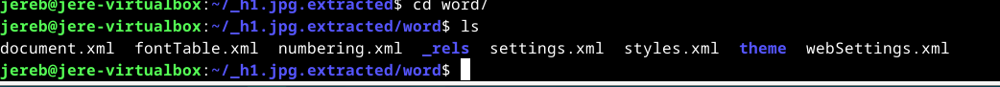
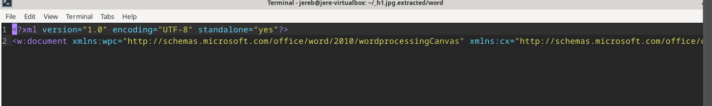

# H6 Sulaa hulluutta

## Käyttöympäristö

Prosessori: AMD Ryzen 5 5500H

RAM: 8 GB DDR4

Näytönohjain: NVIVIA GeForce RTX 2050

OS: Windows 10

## a) Tutki tiedostoa h1.jpg jo opituilla työkaluilla. Mitä saat selville? (27.11.2024)

Aloitin tehtävän lataamalla kuvan, jotta pystyisin tarkastelemaan sitä terminaalin puolella: 

    $ wget https://terokarvinen.com/application-hacking/h1.jpg

Seuraavaksi lähdin tutkimaan mitä kuva sisältää: 

    $ file h1.jpg

Komennon avulla selvisi vähän lisätietoja kuvasta, mutta arvelempa, että se on syönyt muutakin. Lähdin seuraavaksi tutkimaan tiedostoa, `strings` -komennon avulla: 

    $ Strings h1.jpg | less

`Strings`-komennon avulla tiedostosta löytyi omituisia merkkijonoja, mutta en oikein saanut koppia siitä mitä ne tarkoittavat. Päätin tutkia työkaluja netistä ja törmäsin (Piyushagg, 2021) -ohjeeseen exiftool-työkalusta. Päätin ladata työkalyn ja testata: 

    $ sudo apt-get install exiftool
    $ exiftool h1.jpg

Komennon avulla saatiin yksityiskohtaisempaa dataa kuvasta, ja mielestäni se esittää paljon hyödyllistä tietoa. En osaa sanoa, mitä muuta kuvasta pitäisi saada selville, joten en jää pohtimaan asiaa pidempään. 

## ) Tutki tiedostoa h1.jpg binwalk:lla. Mitä tietoja löydät nyt tiedostosta? Mitä työkalua käyttäisit tiedostojen erottamiseen? (Huomaa, että binwalk versio 2.x ja 3.x toimivat eri tavalla.) 

Aloitin lataamalla binwalkin ja tutkin sillä h1.jpg-tiedostoa: 

    $ sudo apt-get install binwalk
    $ binwalk h1.jpg

Komennon avulla selviää, että tiedosto on jonkinlainen zip-arkisto, joka sisältää kuvia (JPEG, TIFF), useita XML-tiedostoja jotka sisältävät esim. Tyylit ja asetukset, Metatiedot ja asiakirjat sekä pääasiakirjan sisällön. Nämä muodostavat luultavasti jonkun word tyyppisen tiedoston.

Seuraavaksi lähdin tutkimaan miten tiedostoja voisi erottaa `binwalkin` avulla. Törmäsin (Roy, A. 2023) artikkeliin "Analysing and extracting firmware using Binwalk" Löysin sieltä seuraavan komennon ja päätin kokeilla: 

    $ binwalk -E h1.jpg

En osaa sanoa muuta entropia taulukosta, kuin se muttuu välillä todella radikaalisti. Tässä kohtaan pyysin ChatGPT 3.5-kielimallilta apua analysoimaan entropia taulukkoa. Tekoälyn mukaan "Rising entropy edge" voi tarkoittaa, että tiedoston sisällä saattaa olla, muutakin dataa kuten pakattuja tiedostoja ja tai joitain salaisia osia. "Falling entropy edge" voi viitata kuvadataan eli tiedostojen rakenne on ennakoitavissa kuten JPEG-tiedostojen datassa. 

Seuraavaksi ajoin komennon: 

    $ binwalk -e h1.jpg

Tämä komento purkaa tiedoston upotetut tiedostot ja luo uuden hakemiston: 

Sieltä paljastui kaiken näköisiä tiedostoja. Ensimmäisenä katsoin mitä "Content Types" sisältää: 

    $ cat '[Content_Types]'

Sieltä löytyi paljon tietoa tiedostoista ja niiden sisältötyypeistä. Seuraavaksi menin tutkimaan `word` tiedostoa: 

Word-hakemisto oli syönyt aika paljon erilaisia xml-tiedostoja, joten päätin lähteä availemaan niitä microlla. Avattuani kaikki hakemistossa olevat tiedostot en löytänyt mitään mielenkiintoista. Kakki olivat alla olevan kuvan kaltaisia:  

Ainut tiedosto mitä en saanut auki oli `494F5` zip-tiedosto. En voinut purkaa sitä, koska se oli ilmeisesti vioittunut jollain tapaa. Kaikki muutkin tiedostot olivat sisällöltääm saman kaltaisia, kuin yllä olevan kuvan tiedosto. 

## c) FOSS (Free Android OpenSource). Tutustu Android-sovelluksiin Offan (2024) listalta: Android FOSS. Valitse listalla itsellesi mielenkiintoisin applikaatio ja mene sen GitHubiin. Lataa ohjelman APK itsellesi ja käytä seuraavia työkaluja tutustuaksesi, miten APK:n voi avata.
## Lähteet 

- Iso-Anttila, L & Karvinen, T. 26.11.2024. Tehtävänanto. h6 Sulaa hulluutta. Luettavissa: https://terokarvinen.com/application-hacking/#h6-sulaa-hulluutta Luettu: 27.11.2024.
- Piyushagg. 11.2.2021. GeeksForGeeks. Installing and Using Exiftool on Linux. Luettavissa: https://www.geeksforgeeks.org/installing-and-using-exiftool-on-linux/ Luettu: 27.11.2024.
- Anindya Sankar Roy. 30.8.2023. Medium. Analysing and extracting firmware using Binwalk. Luettavissa: https://fr3ak-hacks.medium.com/analysing-and-extracting-firmware-using-binwalk-982012281ff6 Luettu: 27.11.2024.
- 
