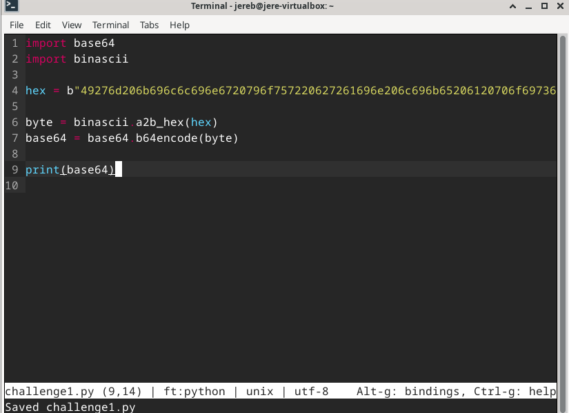
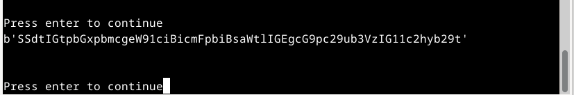

## H7 Uhagre2

## Käyttöympäristö

Prosessori: AMD Ryzen 5 5500H

RAM: 8 GB DDR4

Näytönohjain: NVIVIA GeForce RTX 2050

OS: Windows 10

## Ratkaise CryptoPals Set 1 -haasteet. Tehtävät saa ratkaista millä vain ohjelmointikielellä ja käyttää mitä tahansa tekstieditoria tai IDE:ä. Tehtäviä ei kannata ratkaista tekoälyllä, koska se vain kopioi malliratkaisun suoraan koulutusmateriaalistaan. 

### a) 1. Convert hex to base64

Aloitin avaamalla ensimmäisne haasteen. Seuraavaksi avasin microssa uuden tiedoston nimeltä `challenge1`.

    $ micro challenge1.py

En oikeastaan keksinyt miten voisin kääntää hex-stringin base64 muotoon, joten lähdin suoraan tutkimaan asiaa netistä. Törmäsin (he3, 2023) artikkeliin hex-merkkien kääntämisestä base64-merkeiksi. Kokeilin luoda oman koodini tämän pohjalta hyödyntäen myös materiaalissa olevia vinkkejä. 

Tässä vielä tehtävän tulos: 

