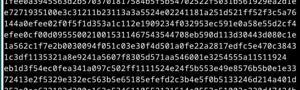

## H7 Uhagre2

## Käyttöympäristö

Prosessori: AMD Ryzen 5 5500H

RAM: 8 GB DDR4

Näytönohjain: NVIVIA GeForce RTX 2050

OS: Windows 10

## x) Lue/katso/kuuntele ja tiivistä. (7.12.2024)

### Schneier 2015: Applied Cryptography 

1.1 Terminology 
-  Tärkeintä salakirjoituksessa on, että mikään väliosapuoli ei voi lukea viestiä.
-  Prosessia viestin sisällön piilottamiseksi kutsutaan salakirjoitukseksi.
-  Symmetriset algoritmit käyttävät samaa salausta ja purkua varten. Molempien osapuolten on sovittava yhteisestä salaisesta avaimesta.
-  Kryptoanalyysi pyrkii paljastamaan salainen avain tai selväkielinen viesti ilman avainta. 

1.4 Simple XOR
- XOR on bittien operaatio, jossa tulos on 1, jos kaksi bittiä ovat eriäviä, ja 0, jos ne ovat samoja.
- Salaus tapahtuu XOR-operaatiolla, jossa teksti XORataan avainsanan kanssa
- Algoritmi on symmetrinen ja helposti murrettavissa. Salaus tarjoaa ei käytännön turvallisuutta 

1.7 Large Numbers
- Kryptografian yhteydessä käytetään usein suuria lukuja, joiden mittakaavaa on vaikea hahmottaa.

 Mielenkiintoisia tilastoja todennäköisyyksistä: 
- Salamaniskusta kuoleminen päivässä: 1:9 miljardia
- Voittaminen Yhdysvaltojen osavaltiolotossa: 1:4 miljoonaa
  
### python basics for hackers

- Artikkelissa käydään läpi perustekniikoita erilaisten toimintojen suorittamiseen.
- Toimintoja ovat mm. pyhton REPL, Ipython.
- Artikkelissa esitetään myös esim. tietotyyppejä, Obfuskaatiota ja silmukoiden käyttöä. 

## Ratkaise CryptoPals Set 1 -haasteet. Tehtävät saa ratkaista millä vain ohjelmointikielellä ja käyttää mitä tahansa tekstieditoria tai IDE:ä. Tehtäviä ei kannata ratkaista tekoälyllä, koska se vain kopioi malliratkaisun suoraan koulutusmateriaalistaan. 

### a) 1. Convert hex to base64 (5.12.2024)

Aloitin avaamalla ensimmäisne haasteen. Seuraavaksi avasin microssa uuden tiedoston nimeltä `challenge1`.

    $ micro challenge1.py

En oikeastaan keksinyt miten voisin kääntää hex-stringin base64 muotoon, joten lähdin suoraan tutkimaan asiaa netistä. Törmäsin (he3, 2022) artikkeliin hex-merkkien kääntämisestä base64-merkeiksi. Kokeilin luoda oman koodini tämän pohjalta hyödyntäen myös materiaalissa olevia vinkkejä. 

Tässä vielä tehtävän tulos: 

### b) 2. Fixed XOR (6.12.2024)

Tehtävä oli täysin hepreaa itselle, joten lähdin etsimään vinkkejä netistä kuinka yhdistää xor-merkkijonot yhteen pythonissa. Löysin netistä (Kültekin, Ö. 2021) artikkelin, josta sain apua tehtävään, sillä edes teron vinkit eivät auttaneet minua tehtävässä. Loin ohjelman nettisivun pohjalta: 

Tässä vielä koodi käännettynä: 

### c) 3. Single-byte XOR cipher. 

Aloitin tehtävän lukemalla tehtävänannon, jonka tarkoituksena oli löytää avain hex-encodatusta merkkijonosta. Lähdin lukemaan Teron vinkkejä, koska minulla ei ollut aavistustakaan kuinka lähteä rakentamaan koodia. Määritin ensimmäisenä yleisimmät merkit englanninkielisessä tekstissä: 

Seuraavaksi hyödynsin chat GPT 3.5 kielimallia siihen, että miten voin kokeilla kaikkia yksitavuisia xor-avaimia: 

Lopuksi tein vielä main-funktion, joka muuntaa hex-merkkijonon tavuiksi: 

Sitten vielä testasin mitä ohjelma oikein tulostaa: 

Tuloksista huomasin, että kaikki muut ovat epämääräisiä paitsi yksi, joten oikea ratkaisu on oltava `Cooking MC's like a pund of bacon`

### d) 4. Detect single-character XOR. 

Aloitin lukemalla tehtävänannon, jonka jälkeen latasin tekstitiedoston: 

    $ wget https://cryptopals.com/static/challenge-data/4.txt 

Seuraavaksi avasin tekstitiedoston: 

    $ cat 4.txt

Löysin tekstin seasta, että yksi merkkijono on lyhyempi kuin muut: 

Päätin kokeilla syöttää tämän edellisen tehtävän ohjelman merkkijonon tilalle: 

Sieltä ei kuitenkaan tulostunut mitään järkevää. Koodia piti selvästi muokata jotenkin Teron vinkkien mukaan. Ohjelmaan piti siis luoda vielä yksi looppi, joka yrittää decryptata jokaisen merkkijonon tekstitiedostosta. En osannut itse suoraan tehdä tällaista looppia, joten hyödynsin tehtävässä chat GPT 3.5 kielimallia ja kysyin kuinka voin luoda loopin, joka tarkastaa tekstitiedostosta kaikki rivit ja decryptaa ne. Lopputulos näytti tältä: 

Kokeilin vielä kääntää ohjelman ja katsoa, mitä se tulostaa: 

## lähteet

- Karvinen, T. 4.12.2024. Tehtävänanto. h7-uhagre2 Luettavissa: https://terokarvinen.com/application-hacking/#h7-uhagre2 Luettu: 5.12.2024.
- He3. 2022. Hex to Base64: Converting Hexadecimal to Base64 Easily. Luettavissa: https://he3app.com/blogs/hex-to-base64-converting-hexadecimal-to-base64-easily Luettu: 5.12.2024.
- Kültekin, Ö. 26.1.2021. Medium. Crypto Basics: Fixed XOR implementation [Python][Cryptopals] Luettavissa:  https://medium.com/analytics-vidhya/crypto-basics-fixed-xor-implementation-python-9cfba54f4661 Luettu: 6.12.2024
- NCC group. The cryptopals challenges. Luettavissa: https://cryptopals.com/sets/1 Luettu: 6.12.2024
- Scheier, B. 3. 2015. Applied Cryptography: Protocols, Algorithms and Source Code in C, 20th Anniversary Edition Luettavissa: https://learning.oreilly.com/library/view/applied-cryptography-protocols/9781119096726/?ar= Luettu: 7.12.2024. 

